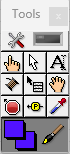
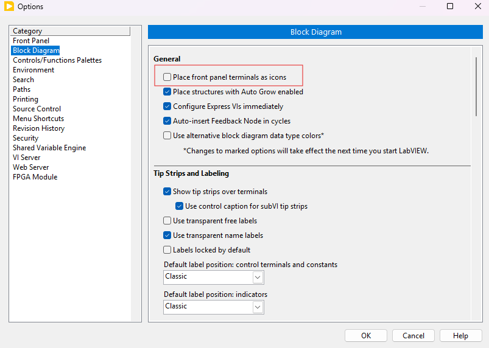
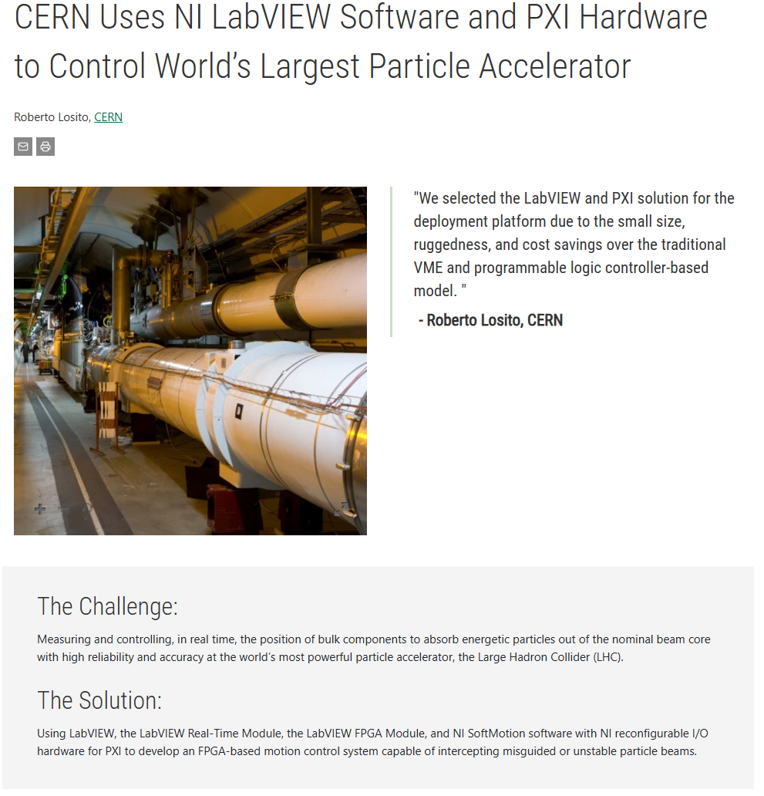

# LABVIEW Basics

LabVIEW : Laboratory Virtual Instrument Engineering Workbench
VI : Virtual Instruments

> Give a decent name describing the project to the `.lvproj` file. Creating a main vi as `Main.vi` is a good practice.

I like to see the iteration number when using for loops, using wait for the VIs running on PC helps CPU a lot.

We can create sub VIs by selecting them, and clicking `Edit -> Create SubVI`. We need to save it as VI with a good name.

In the SubVI Fron Panel, we can change the Icon of it. Always check the connection options and arrange them accordingly.

We can see our new sub VI as `Arith4` and call it as much as possible in other VIs like any other blocks.

Here, I called and used it.

We can change the backgraound of the front panel by right-clicking to the side scroll bar of it `Properties->Background`. So, we can create custom backgrounds.

In the tools palette, there is brush we can paint everything on the front panel including the background.

`CTRL+M` shows how front panel or block diagram look like in the run mode. 

`Ctrl+E` switch between Front Panel and Block Diagram.

`Ctrl+R` run the VI

We can change the behavior of the button by using the following option.

This is helpful as well.

This is intriguing..

