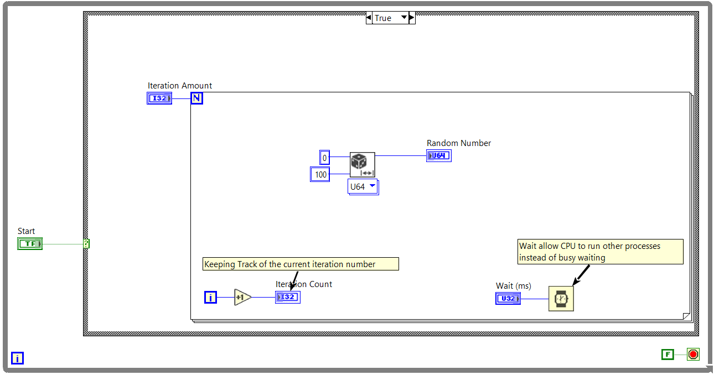
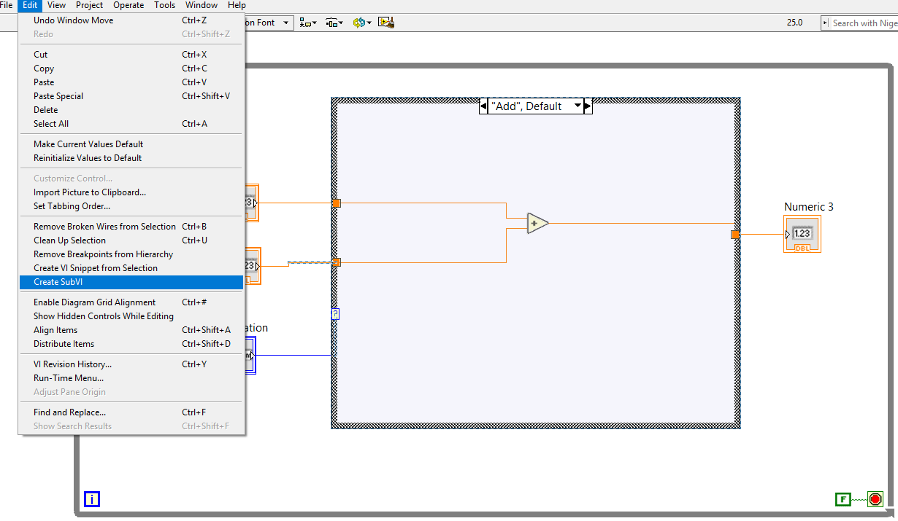
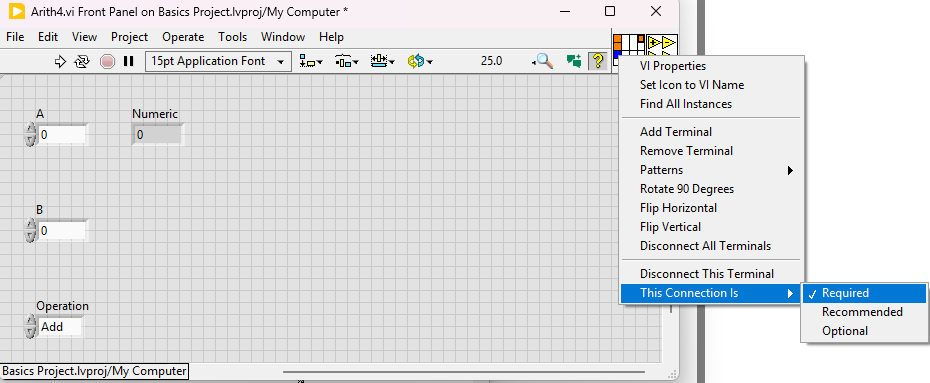
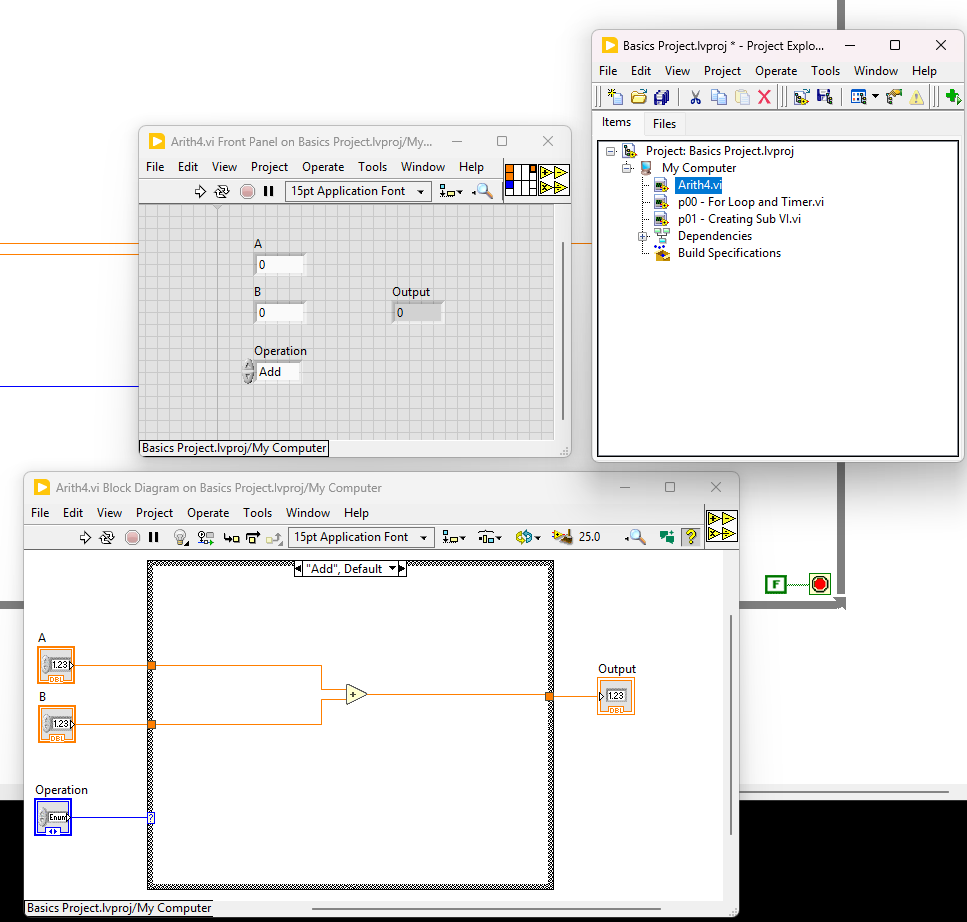
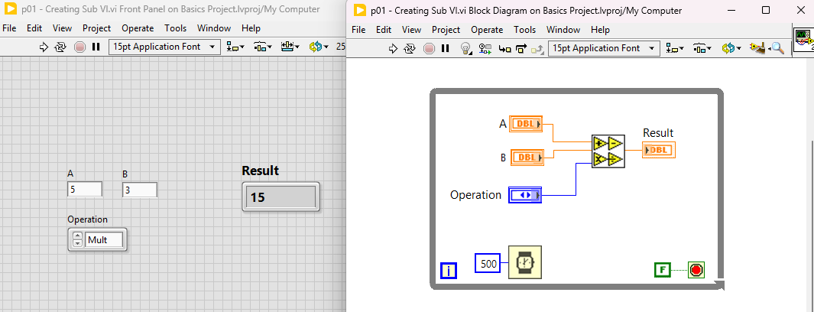

# LABVIEW Basics

I like to see the iteration number when using for loops, using wait for the VIs running on PC helps CPU a lot.

We can create sub VIs by selecting them, and clicking `Edit -> Create SubVI`. We need to save it as VI with a good name.

In the SubVI Fron Panel, we can change the Icon of it. Always check the connection options and arrange them accordingly.

We can see our new sub VI as `Arith4` and call it as much as possible in other VIs like any other blocks.

Here, I called and used it.

